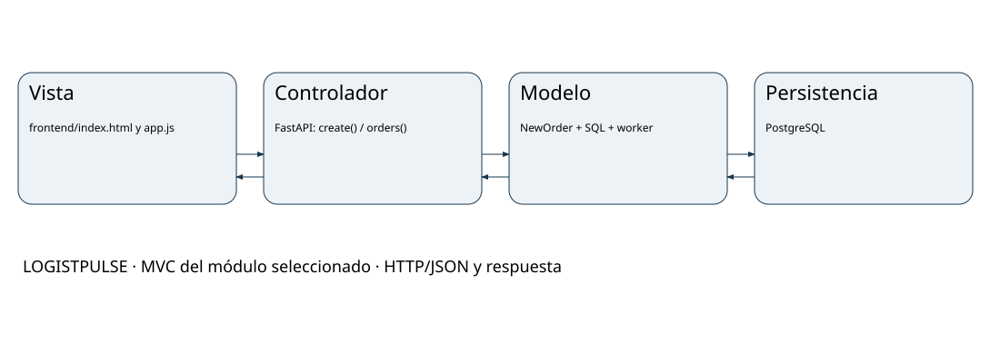

# MVC LOGISTPULSE

## Vista
frontend/index.html y app.js: Kitchen queue. fulfillment() muestra pedidos; newOrder() crea un pedido demo y vuelve a consultar.

## Controlador
Rutas FastAPI de services/fulfillment-api/app.py: create(), orders() y health(). Reciben HTTP, validan tipos con Pydantic y devuelven JSON.

## Modelo lógico
NewOrder representa la entrada; orders es la entidad persistida. conn()/bootstrap() y SQL realizan el acceso a datos. El worker aplica la preparación.

## Persistencia y límites
PostgreSQL fulfillment_db.orders. create() publica ORDER_CREATED en Redpanda; fulfillment-worker actualiza PREPARING y READY. Nginx es el punto de entrada.

## Justificación
FastAPI funciona como Controlador REST y la Vista HTML/JS consume sus rutas. La separación MVC es lógica: la plantilla concentra rutas, modelo de entrada y SQL en app.py; no afirmamos que existan módulos Model/Repository separados. La arquitectura diseñada identifica esas responsabilidades y permite extraer el acceso a datos más adelante. El worker es procesamiento de dominio, no una pantalla ni un Controlador HTTP. El patrón adicional es procesamiento asíncrono por eventos.

## Límites
Guardar el pedido y publicar el evento no es una única transacción distribuida. Si la publicación falla, no hay recuperación garantizada. NewOrder no impide totales negativos. Estas mejoras permanecen fuera del Sprint 1. /health no comprueba por sí solo la base de datos.

